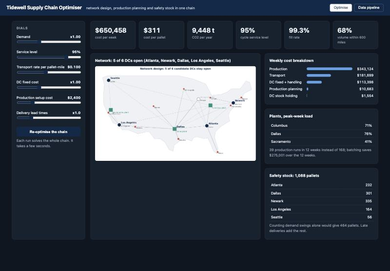

# Supply Chain Optimization

*Tidewell Beverages, a fictional US drinks company: from messy ERP, WMS and TMS data to a network, production and inventory decision.*

An end-to-end supply chain project for a fictional American drinks company (plants in Columbus, Dallas and Sacramento; DCs from Atlanta to Seattle; dollars and road miles): messy ERP, WMS and TMS extracts are cleaned by an ETL,
loaded into a clean data store, and fed to three optimisation models (network design, production planning, safety stock). On top of the
models sits a decision layer: savings against a reference case, a whole-chain comparison of every DC set, stress tests, input sensitivity and cost
to serve. A dashboard re-runs the whole chain live.


The dashboard re-runs the whole chain when you move a dial:



## From data to decision

1. **Data in.** 9,128 raw ERP order lines, 240 WMS goods receipts and 102 TMS lanes (simulated, deliberately messy).
2. **Cleaned.** The ETL removes 132 duplicate, 176 cancelled and 6 broken lines, converts units and kilometres, and reconciles every unit: 8,814 clean lines become 84 weekly demand profiles (mean and spread per market and item).
3. **Inputs checked.** Freight rate, holding rate, trailer size and road distances benchmarked against 2026 sources ([docs/DATA_AND_ASSUMPTIONS.md](docs/DATA_AND_ASSUMPTIONS.md)).
4. **Modelled.** Network design picks DCs and flows, Wagner-Whitin plans production, and safety stock covers demand swings and late deliveries.
5. **Tested.** Every DC combination costed on the whole chain, nine stress tests, sensitivity on every input and assumption, and the same checks on ten other synthetic companies.
6. **Conclusion.** The cheapest network closes Chicago ($650,458 a week, 3.7% below the reference case). Keeping all six DCs costs only 0.4% more and lifts next-day coverage from 68% to 80%, so the recommendation is to keep all six. 57% of safety stock exists because deliveries arrive late, and production runs fall from 168 to 39.

**Start with [docs/ONE_PAGE_SUMMARY.md](docs/ONE_PAGE_SUMMARY.md) (one page), then [docs/PROJECT_STORY.md](docs/PROJECT_STORY.md) (the story and how AI was used).**

| For | Read |
| --- | --- |
| What data it uses and how much each input matters | [docs/DATA_AND_ASSUMPTIONS.md](docs/DATA_AND_ASSUMPTIONS.md) |
| Whether it holds up on other data | [docs/ROBUSTNESS.md](docs/ROBUSTNESS.md) |
| The decision a manager would take | [docs/EXECUTIVE_SUMMARY.md](docs/EXECUTIVE_SUMMARY.md) |
| How it works, in plain words | [docs/HOW_IT_WORKS.md](docs/HOW_IT_WORKS.md) |
| Mistakes found and fixed | [docs/AUDIT.md](docs/AUDIT.md) |
| Interview questions with answers | [docs/INTERVIEW_QA.md](docs/INTERVIEW_QA.md) |

The case structure was inspired by a Supply Science video; see [docs/ATTRIBUTION.md](docs/ATTRIBUTION.md).

## What it finds (base case)

- The lowest-cost network closes Chicago: **$650,458 a week, 3.7% below a reference case** of all six DCs open. Keeping all six costs only 0.4% more and raises next-day coverage from 68% to 80%, so the recommendation is to keep all six: the real decision is service, not cost.
- Production runs fall from 168 to 39 over 12 weeks, inside plant capacity and shelf-life limits.
- 57% of safety stock exists because deliveries arrive late, not because demand swings.
- Demand can grow about 40% before the network cannot serve it. Losing Columbus or Dallas leaves demand unmet, and a next-day (600 mile) promise cannot be met from these sites.

[docs/AUDIT.md](docs/AUDIT.md) lists the mistakes a supply chain manager would spot in a project like this and how each was fixed.

## Run it

```bash
python3 -m venv .venv && .venv/bin/pip install -r requirements.txt
.venv/bin/python -m tidewell.run                 # data, ETL, models, analytics; writes output/, charts/, docs/EXECUTIVE_SUMMARY.md (about 2 minutes)
.venv/bin/python verify.py                       # checks on Tidewell, its inputs and the documents (about 3 minutes)
.venv/bin/python -m tidewell.robustness          # the same checks on 10 other synthetic companies (about 3 minutes)
.venv/bin/uvicorn tidewell.api:app --port 8000   # dashboard at http://localhost:8000
```

## Layout

| Path | What it holds |
| --- | --- |
| `tidewell/company.py` | the fictional company and the dials the models read |
| `tidewell/sources.py` | plays the ERP, WMS and TMS: writes messy raw extracts |
| `tidewell/etl.py`, `store.py` | extract, clean, transform, load; then build the company from clean tables |
| `tidewell/network.py` | mixed integer program: which DCs, which flows |
| `tidewell/lotsizing.py` | Wagner-Whitin and the capacity-aware production plan |
| `tidewell/safetystock.py` | safety stock, reorder points, fill rate |
| `tidewell/chain.py` | the three models in sequence, with the scorecard |
| `tidewell/analytics.py` | savings, DC set comparison, stress tests, sensitivity, cost to serve |
| `tidewell/api.py`, `web/` | API and dashboard |
| `tidewell/checks.py`, `verify.py` | checks that hold for any company, plus Tidewell-only checks on inputs and documents |
| `tidewell/synthetic.py`, `robustness.py` | generator of other synthetic companies and the robustness test |
| `data/raw`, `data/warehouse` | messy extracts and clean tables |
| `output/`, `charts/` | result tables (CSV) and charts (PNG) |

Everything is simulated and deterministic.
