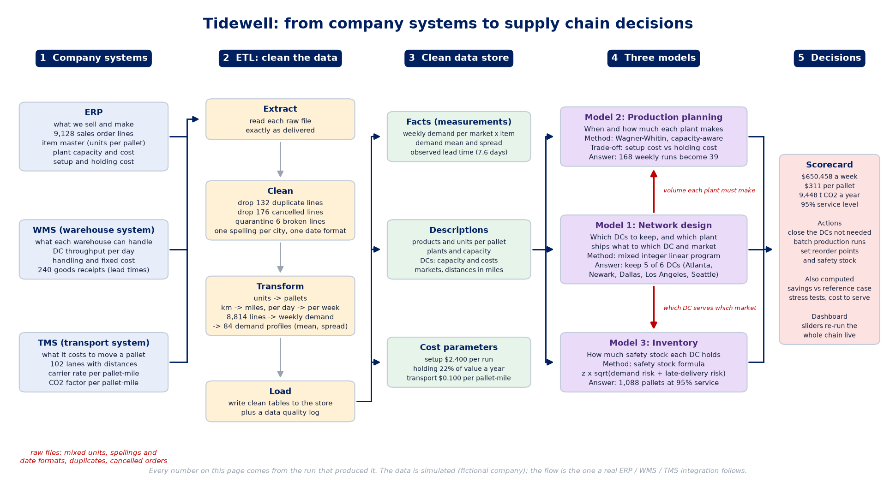

# Tidewell supply chain optimiser: one page

**What it is.** An end-to-end analytics project for a fictional US drinks company: simulated ERP, WMS and TMS data, an ETL, three optimisation models (network design, Wagner-Whitin production planning, lead-time-aware safety stock), a decision layer, a dashboard and automated checks that run on Tidewell and on ten other synthetic companies. Built with an AI assistant, then audited as a supply chain manager would audit it.

**The question.** Which distribution centres should Tidewell run, when should each plant produce, and how much safety stock should each DC hold, so cost is lowest at a 95% service level?

## Results

| | |
| --- | --- |
| Cost of the lowest-cost network | $650,458 a week ($33.8M a year), $311 a pallet |
| Saving against a reference case (all DCs open, weekly production) | 3.7%: $25,272 a week, $1.31M a year |
| Production runs over 12 weeks | 168 become 39 |
| Safety stock | 1,088 pallets; in this simulated company 57% exists because deliveries arrive late (32% at half the assumed delivery-time spread, 77% at double) |
| The real decision | Closing Chicago is cheapest, but keeping all six DCs costs only 0.4% more and lifts next-day coverage from 68% to 80%. Recommendation: keep all six |
| Resilience | Demand can grow 40% before the network breaks; losing Columbus or Dallas leaves demand unmet |

## Why it can be trusted

- **Inputs:** every input is classed as simulated, benchmarked or assumed, with its source and its effect on the answer (`docs/DATA_AND_ASSUMPTIONS.md`). Freight rate, holding rate, trailer size and road distances were checked against 2026 benchmarks and known driving distances.
- **Validation:** the ETL recovers the company's true figures from the messy files exactly; the production plan matches textbook Wagner-Whitin where capacity does not bind; brute force confirms the network choice.
- **Robustness:** the same pipeline and checks pass on 10 other synthetic companies of different size, geography and cost structure (`docs/ROBUSTNESS.md`).
- **Honesty:** the exact DC set moves with the freight rate, delivery radius and road factor, and the docs say so. The saving is modest and the project explains why.

## How AI was used

AI wrote the code. The supply chain judgement was applied around it: framing the question, requiring realism, auditing the first draft (16 problems found, such as a holding cost equal to about 200% of a water pallet's value a year), and refusing to accept results that could not be explained. Credit for the case idea goes to the Supply Science video that inspired it (`docs/ATTRIBUTION.md`).

**Read next:** `docs/PROJECT_STORY.md`, `docs/EXECUTIVE_SUMMARY.md`, `docs/AUDIT.md`.
